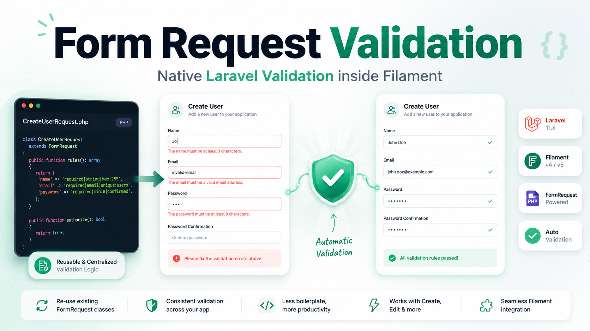

# Form Request Validation for Filament

[](https://packagist.org/packages/occ-therapist/form-request-validation-for-filament)
[](https://packagist.org/packages/occ-therapist/form-request-validation-for-filament)
[](https://opensource.org/licenses/MIT)
[](https://github.com/OccTherapist/form-request-validation-for-filament)



Use Laravel [Form Request](https://laravel.com/docs/validation#form-request-validation) validation inside Filament — define your rules, messages, and attributes once, reuse them across API routes, controllers, and Filament UI.

## Why this plugin?

Filament validates fields through dedicated methods like `->required()` and `->email()` on each input. That works well for simple forms, but validation logic often belongs in a central place — especially when the same rules already exist in a Form Request.

This plugin bridges that gap: attach a Form Request to your schema or table filters and its validation rules are automatically applied to the matching fields.

## Features

- **Form Request integration** — `rules()`, `messages()`, and `attributes()`
- **Automatic field mapping** — by field name, dot notation, and wildcards (`items.*.name`)
- **Array & pipe syntax** — `'email' => ['required', 'email']` and `'email' => 'required|email'`
- **Context-aware** — different Form Requests per page via callback (create vs. edit)
- **Dynamic rules** — re-resolved on every validation (`required_if`, `Rule::unique()`, etc.)
- **Request simulation** — route parameters and input context for Form Requests
- **Smart rule merging** — Form Request rules take precedence on conflicts
- **Orphan rule handling** — unmatched rules show a Filament notification
- **`getFormRequestValidated()`** — optional helper trait for validated data
- **Filament 4 & 5** — single package, internal adapter layer

## Supported contexts

| Context | API |
|---|---|
| Resource Create / Edit | `Schema::formRequest()` |
| Standalone forms / Settings pages | `Schema::formRequest()` |
| Action modals | `Schema::formRequest()` |
| Wizards (per-step validation) | `Schema::formRequest()` |
| Relation managers | `Schema::formRequest()` |
| Table filters | `Table::filtersFormRequest()` |

## Requirements

| Dependency | Version |
|---|---|
| PHP | 8.2+ |
| Laravel | 11, 12, or 13 |
| Filament | 4.x or 5.x |

## Installation

```bash
composer require occ-therapist/form-request-validation-for-filament
```

Auto-registers via Laravel package discovery. No manual setup required.

## Quick start

### 1. Create a Form Request

```php
// app/Http/Requests/StoreUserRequest.php

namespace App\Http\Requests;

use Illuminate\Foundation\Http\FormRequest;

class StoreUserRequest extends FormRequest
{
    public function rules(): array
    {
        return [
            'name' => ['required', 'string', 'max:255'],
            'email' => ['required', 'email', 'unique:users'],
        ];
    }

    public function messages(): array
    {
        return [
            'email.unique' => 'This email address is already registered.',
        ];
    }

    public function attributes(): array
    {
        return [
            'name' => 'full name',
        ];
    }
}
```

### 2. Attach it to your Filament schema

```php
use App\Http\Requests\StoreUserRequest;
use App\Http\Requests\UpdateUserRequest;
use Filament\Resources\Pages\CreateRecord;
use Filament\Resources\Pages\EditRecord;
use Filament\Schemas\Schema;

public function form(Schema $schema): Schema
{
    return $schema
        ->components([
            TextInput::make('name'),
            TextInput::make('email'),
        ])
        ->formRequest(
            class: fn () => $this instanceof EditRecord
                ? UpdateUserRequest::class
                : StoreUserRequest::class,
        );
}
```

> **Important:** Call `->formRequest()` **after** `->components()` so the validation hook is appended correctly.

Validation errors appear directly on the matching input fields.

## API reference

### `Schema::formRequest()`

```php
$schema->formRequest(
    class: fn (Component $livewire): string => StoreUserRequest::class,
    mergeInput: fn (array $state, Component $livewire): array => $state,
);
```

| Parameter | Type | Required | Description |
|---|---|---|---|
| `class` | `Closure` | Yes | Returns the Form Request class. Receives `$livewire` via dependency injection. |
| `mergeInput` | `Closure` | No | Merges additional data into the simulated request input. Receives `$state` and `$livewire`. |

#### Context selection

```php
->formRequest(
    class: fn () => match (true) {
        $this instanceof CreateRecord => StorePostRequest::class,
        $this instanceof EditRecord => UpdatePostRequest::class,
        default => StorePostRequest::class,
    },
)
```

#### Enriching input data

```php
->formRequest(
    class: fn () => UpdateUserRequest::class,
    mergeInput: fn (array $state) => [
        ...$state,
        'role' => $this->record?->role,
        'tenant_id' => filament()->getTenant()?->id,
    ],
)
```

Useful when Form Requests depend on record data, route parameters, or values not visible in the form.

### `Table::filtersFormRequest()`

```php
$table->filtersFormRequest(
    class: fn () => FilterCustomersRequest::class,
    mergeInput: fn (array $state, Component $livewire): array => $state,
);
```

Same parameters as `Schema::formRequest()`. Attaches validation to the table's filter form.

| Filter mode | When validation runs |
|---|---|
| Deferred (default) | When the user clicks **Apply** |
| Live (`->deferFilters(false)`) | On every filter change |

## Usage by context

### Resource pages

```php
public function form(Schema $schema): Schema
{
    return $schema
        ->components([/* fields */])
        ->formRequest(class: fn () => StoreUserRequest::class);
}
```

### Action modals

```php
Action::make('invite')
    ->schema(fn (Schema $schema) => $schema
        ->components([
            TextInput::make('email'),
            TextInput::make('role'),
        ])
        ->formRequest(class: fn () => InviteUserRequest::class))
    ->action(function (array $data): void {
        // ...
    });
```

### Wizards

One Form Request for the entire wizard — attach it to the root schema:

```php
return $schema
    ->components([
        Wizard::make([
            Step::make('Account')->schema([
                TextInput::make('email'),
            ]),
            Step::make('Profile')->schema([
                TextInput::make('name'),
            ]),
        ]),
    ])
    ->formRequest(class: fn () => StoreUserRequest::class);
```

Only fields in the **active step** are validated per step. Use `mergeInput` if rules depend on data from other steps:

```php
mergeInput: fn (array $state, Component $livewire): array => [
    ...($livewire->data ?? []),
    ...$state,
],
```

### Relation managers

```php
class PostsRelationManager extends RelationManager
{
    public function form(Schema $schema): Schema
    {
        return $schema
            ->components([
                TextInput::make('title'),
            ])
            ->formRequest(class: fn () => StorePostRequest::class);
    }
}
```

For modal actions on the table, attach `formRequest()` inside the action's schema callback.

### Table filters

```php
use Filament\Tables\Filters\Filter;
use Filament\Tables\Table;

public function table(Table $table): Table
{
    return $table
        ->filters([
            Filter::make('created')
                ->schema([
                    DatePicker::make('from'),
                    DatePicker::make('until'),
                ]),
        ])
        ->filtersFormRequest(class: fn () => FilterCustomersRequest::class);
}
```

```php
// app/Http/Requests/FilterCustomersRequest.php
public function rules(): array
{
    return [
        'created.from' => ['nullable', 'date'],
        'created.until' => ['nullable', 'date', 'after_or_equal:created.from'],
    ];
}
```

## Field mapping

Rules are matched to fields **automatically by name** — no per-field configuration needed.

| Form Request key | Filament field | Match type |
|---|---|---|
| `email` | `TextInput::make('email')` | Exact |
| `address.street` | `TextInput::make('address.street')` | Dot notation |
| `items.*.name` | Repeater child `TextInput::make('name')` | Wildcard |
| `created.from` | Filter field `DatePicker::make('from')` in `Filter::make('created')` | Dot notation |

### State path normalization

Filament uses prefixed state paths internally. The plugin strips these automatically:

| Internal state path | Resolved key |
|---|---|
| `data.email` | `email` |
| `mountedActions.0.data.email` | `email` |
| `tableDeferredFilters.created.from` | `created.from` |

## Rule merging

When a field already has Filament validation rules, both sets are merged:

```php
TextInput::make('email')->email()->nullable()
```

```php
// Form Request
'email' => ['required', 'email', 'unique:users']
```

**Result:** `string`, `required`, `email`, `unique:users`

- Form Request rules take **precedence** on conflicts (`nullable` vs. `required`)
- Identical rules are **deduplicated**
- Non-conflicting field rules are **kept**

## Orphan rules

Rules without a matching schema field still run on submit. Failures show a **Filament notification** instead of an inline field error.

To show the error on a field, add a matching input (visible or hidden):

```php
Checkbox::make('terms_accepted')->label('I accept the terms'),
// or
Hidden::make('terms_accepted'),
```

## Accessing validated data

```php
use OccTherapist\FormRequestValidationForFilament\Concerns\InteractsWithFormRequestValidation;

class CreateUser extends CreateRecord
{
    use InteractsWithFormRequestValidation;

    protected function handleRecordCreation(array $data): Model
    {
        $data = $this->getFormRequestValidated();

        return User::create($data);
    }
}
```

## How it works

```
formRequest() / filtersFormRequest()
        │
        ▼
  Form Request resolved with simulated HTTP request
  (form state + optional mergeInput + route parameters)
        │
        ▼
  rules(), messages(), attributes() extracted
        │
        ▼
  Rules mapped to fields (exact + wildcard + state path normalization)
        │
        ▼
  Merged with existing field rules → applied on validation
        │
        ▼
  Orphan rule failures → Filament notification
```

## Limitations

| Form Request feature | Status |
|---|---|
| `rules()` | Supported |
| `messages()` | Supported |
| `attributes()` | Supported |
| `authorize()` | Not supported — use Filament policies |
| `prepareForValidation()` | Not supported |
| `withValidator()` | Not supported |
| `passedValidation()` / `failedValidation()` | Not supported |

## Testing

```bash
composer test
```

## Contributing

Contributions are welcome! Please open an issue or pull request on [GitHub](https://github.com/OccTherapist/form-request-validation-for-filament).

## License

MIT © [occTherapist](https://github.com/OccTherapist)
